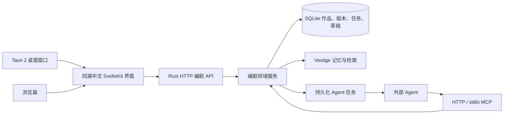

# 中文编剧工作台与 Tauri 桌面端设计

状态：设计完成，按随附自评记录进入实现。分支：`kx-dev`。

## 1. 已确认的目标

1. 将现有前端改为完整可用的简体中文版本，覆盖导航、页面、操作、状态、空状态、错误提示及无障碍标签。
2. 交付 Tauri 2 桌面应用，复用 SvelteKit 与 Rust 服务，支持实际 macOS 安装与运行。
3. 用户上传剧本，外部 Agent 分析作品并提炼可追溯的编剧方法；用户通过对话和版本差异调整编剧角色。
4. 新增编剧 MCP 工具，让 Agent 获取角色规则、作品证据、项目设定，完成原创剧本写作、保存和审稿。
5. 先设计、自行 review 和修订，再实现与验收。

用户已选择：**短剧、网剧优先；由外部 Agent 完成生成，系统提供记忆与编剧规则。** 本版本不内置生成模型，不要求用户配置第三方模型密钥，也不把 embedding 模型称为编剧模型。

本文的“编剧角色”是带版本的创作方法与偏好集合；剧本中的人物属于创作项目的“人物设定”，两者独立。

## 2. 当前系统及需要补齐的边界

| 源码事实 | 设计影响 |
|---|---|
| SvelteKit 使用 `adapter-static`，Rust 嵌入 dashboard 构建产物 | 复用界面和现有 HTTP API，不重写已有可视化 |
| 导航集中在 `apps/dashboard/src/lib/os-routes.ts`，多数页面文案直接写英文 | 建立中文文案与术语层，逐页检查动态字符串和图形标签 |
| 浏览器 API 使用 `/api`，WebSocket 依赖同源 `/ws` | 桌面窗口与本地服务同源，避免另一套页面请求逻辑 |
| `vestige-mcp` 有完整模型预热、维护、HTTP MCP 和 dashboard；stdin EOF 会结束进程 | 增加真正的 `--daemon` 启动方式，桌面侧车使用同一完整启动路径 |
| 当前已支持 Qwen / Metal、可选模型重新挂载、多语言重排序 | 编剧相关检索复用现有能力；生成仍由 Agent 提供 |
| 当前 MCP 工具入口是 `server.rs`，HTTP / stdio 共用工具实现 | 编剧工具只实现一次，同时服务桌面和外部 Agent |
| scope 是查询隔离条件，不是多租户鉴权机制 | 明确定位单用户本地服务；以角色、项目 ID 强制过滤 |
| 现有数据库备份覆盖 SQLite，不自动覆盖额外素材文件 | 原始上传及解析结果进入 SQLite，使完整备份可恢复作品与角色 |
| 当前不存在完整的作品解析、编剧角色版本、Agent 任务队列 | 新增编剧领域存储、业务模块和传输适配，避免塞进普通记忆文本 |

## 3. 产品结构与主要流程

新增主入口“编剧工作台”，保留记忆库、观测台、记忆宫殿和现有管理能力。

工作台包含：

- **编剧角色**：名称、创作定位、题材、目标受众、活跃版本、作品数量、规则状态。
- **作品素材**：文件上传、解析状态、分段预览、来源定位、提炼任务。
- **角色对话**：提出调整、查看 Agent 回复、对比规则版本、应用调整或保留现状。
- **创作项目**：短剧/网剧/电影/长剧、集数、单集时长、人物、世界观、故事约束。
- **写作与审稿**：创作简报、任务状态、Agent 草稿、版本、审稿意见、文本导出。
- **Agent 待办**：等待领取、处理中、失败、完成、取消；显示领取者和可重试状态。

### 3.1 上传与提炼

1. 创建编剧角色并填写创作定位，不强制填写真实作者姓名。
2. 上传一部或多部作品，填写作品名、作者、集数等元数据。
3. 本地解析文本，展示实际提取量与段落；空文本、扫描 PDF、格式损坏明确报错。
4. 用户发起“提炼编剧方法”，创建持久化 Agent 任务。
5. Agent 领取任务，分页读取分段文本，按统一 schema 提交规则、证据、适用条件与例外。
6. 服务校验引用确实属于该角色的作品，原文摘录能在指定分段找到。
7. 提炼结果成为候选角色版本；界面展示新增规则和来源，应用后成为活跃版本。

不存在 Agent 连接时，状态明确显示“等待 Agent 处理”，不返回伪造的模型回复或虚构进度。

### 3.2 对话调校

用户输入“减少旁白、提高每集末尾悬念，但不要靠误会拖剧情”等意见。系统保存原始反馈并创建角色对话任务，Agent 获得当前角色版本、相关规则、近期对话及用户要求，返回：

- 给用户的中文解释；
- 修改后的完整候选规则集合；
- 每条规则的来源：作品证据或用户反馈；
- 修改原因、适用范围及可能冲突。

界面展示版本差异，用户可应用候选版本。新任务绑定 `base_version`；旧版本任务返回时不能覆盖更新的角色。规则优先级为：项目明确约束 > 用户明确偏好 > 已确认的作者方法 > 尚未确认的提炼建议。普通聊天不会直接修改活跃角色。Agent 可以仅返回解释性回复，不创建任何候选规则；明确提交空规则数组则表示拟清空规则，仍须用户采纳。

### 3.3 Agent 写剧本

Agent 获取固定版本的编剧规则及项目设定，结合用户命题完成原创大纲、分集或场景。写作结果保存为草稿版本，审稿结果引用草稿中的具体段落。用户采纳的改法可通过角色对话形成新的候选版本。

系统不承诺“必然爆款”；提炼作者特征与判断市场效果分开。市场表现必须有独立来源，不能从文本风格推断收视、播放量或商业因果。

## 4. 技术架构



### 4.1 Tauri 的职责

- 原生窗口、菜单、应用生命周期和打包；前端不获得任意 shell 或任意文件系统权限。
- 优先检测已有兼容的本地服务，读取健康状态及编剧 API 版本后连接。
- 没有可用服务时启动随应用打包的 `vestige-mcp` 侧车，显式传递数据目录和回环端口。
- 侧车调用完整 `--daemon --http` 模式，包括模型、维护和 MCP；不使用功能不完整的独立启动分支。
- 前端由本地服务提供，同源 HTTP / WebSocket 保持现有行为；Tauri 的启动页只负责展示连接状态。
- 外部网页不获得 Tauri IPC 能力。窗口导航限制本地服务来源；外部链接交给系统浏览器。
- 关闭窗口默认隐藏；明确“退出应用”停止由应用启动的侧车。接入的独立常驻服务不会因窗口退出而停止。
- 端口被其他程序占用时给出明确错误，不连接未经版本识别的任意 localhost 页面。
- 保留 `--data-dir`，数据位于系统用户数据目录，不写入 `.app` 或仓库。

这是原生桌面客户端与 Rust 侧车服务的组合，保留 HTTP MCP 给外部 Agent 使用；不是把服务功能搬到浏览器，也不是启动多个重复的 GPU 模型实例。

### 4.2 WebKit 与可视化

macOS Tauri 使用系统 WebKit。WebGPU 能力必须运行时检测，不能因 Chromium 测试通过就宣称 WebKit 通过。编剧工作台全部核心操作使用 DOM；记忆库等业务页面在没有 WebGPU 时仍可操作。现有 3D 内容保留能力检测及中文降级说明。

### 4.3 建议模块

```text
apps/dashboard/src/lib/i18n/                 中文术语与文案
apps/dashboard/src/routes/(app)/writer/      编剧工作台
apps/desktop/                               Tauri 启动页、原生配置与打包
crates/vestige-core/src/writer/              类型、解析、存储、角色与任务约束
crates/vestige-mcp/src/tools/writer.rs        MCP schema 与分发
crates/vestige-mcp/src/dashboard/writer.rs    HTTP 上传与工作台接口
docs/design/WRITER-STUDIO-REVIEW.md           设计自评与修订记录
docs/WRITER-STUDIO.md                        用户与 Agent 使用说明
```

传输层不复制业务逻辑。数据库访问在有界阻塞工作中进行，网络请求不持有数据库写锁；已修复的异步 embedding 桥接继续复用。

编剧上下文以版本化规则与逐字证据为权威，完整保留所选项目的约束。原作不复制进普通记忆表，避免跨版本混用及删除断链。Agent 需要其他长期项目记忆时，可另行调用现有 `recall` 并明确 scope；不能把未经确认的普通记忆自动升级为编剧规则。

## 5. 数据设计与持久性

所有编剧表使用独立前缀并通过数据库迁移创建。UUID 为内部身份，标题不是主键。

| 实体 | 核心字段与约束 |
|---|---|
| 编剧角色 | id、name、description、active_version、created_at、updated_at |
| 角色版本 | role_id、version、base_version、status、rules_json、summary、task_id；版本发布后不可原地编辑 |
| 作品 | id、role_id、title、filename、media_type、sha256、raw_bytes、text、metadata_json、status |
| 来源分段 | source_id、segment_id、ordinal、text、定位元数据；正文归属于作品版本 |
| 角色消息 | id、role_id、speaker、content、task_id、created_at；用户反馈不可被 Agent 改写 |
| Agent 任务 | id、role_id、project_id、kind、base_version、input_json、status、agent_id、lease_token、lease_until、result_json、error |
| 创作项目 | id、role_id、role_version、name、format、brief、canon_json、revision |
| 草稿 | id、project_id、role_version、kind、title、content、revision、task_id、created_at |
| 审稿 | id、draft_id、draft_revision、role_version、findings_json、summary、task_id |

角色规则结构：`id / category / title / instruction / rationale / applies_to / exceptions / evidence[]`。

规则类别包含故事前提、人物动机、冲突、节奏、伏笔、台词、反转、集尾悬念、结局、格式和用户偏好。证据包含 `source_id / segment_id / quote`，或 `message_id / quote`。不把模型自报 confidence 当作事实可信度。

### 5.1 素材格式

- 支持 UTF-8 TXT、Markdown、Fountain、FDX、DOCX、可提取文本的 PDF。
- 限制单文件 50 MiB；DOCX 解压总量、XML 深度、PDF 页数与提取文本量另设上限，防止小文件解压或解析耗尽资源。
- FDX / DOCX 禁用外部实体；文件名只作为显示元数据，不作为任意写入路径。
- 扫描 PDF 无可提取文字时显示“请先 OCR 后重新上传”；本版本不宣称内置 OCR。
- 保留原始文件 hash 与解析版本；重复上传同一角色下相同内容不会创建重复作品。
- 场次识别采用保守分段；无法识别标准场景标题时按自然段切分，不虚构场次或页码。
- 大文本按稳定 segment_id 分页提供给 Agent，不将整部长剧塞进一次 MCP 响应。

### 5.2 删除与备份

- 删除作品前检查引用。尚未参与提炼的作品可单独删除；已经参与任务或版本的作品返回 `SOURCE_IN_USE`，界面说明依赖关系。需要彻底清除其派生内容时，先处置关联项目，再删除整个角色；不以仅删除原件冒充完整遗忘，也不破坏不可变历史版本。
- 删除角色要求明确确认，并删除角色所属作品、对话、任务与版本；关联创作项目必须先明确处置，不能跨项目静默删除。
- 审计只保留无正文的动作与对象标识；不能在 tombstone 中保留剧本片段。
- 原始上传进入 SQLite，因此现有一致性数据库备份包含素材和编剧状态；恢复时验证作品 hash、角色版本、草稿与任务。
- 既有 portable JSON / 云同步不自动获得编剧实体支持。界面明确数据库完整备份与传统记忆导出的不同覆盖范围。

## 6. Agent 任务与并发协议

任务种类：`extract / role_chat / write / review`。状态：

```text
queued -> leased -> completed
              |-> failed
              |-> cancelled
queued -----------------> cancelled
expired lease -> queued（重新领取）
```

- 领取使用 SQLite 原子条件更新；同一任务同时只允许一个有效 lease。
- lease 默认 5 分钟，可心跳续期；服务重启后任务仍在，过期 lease 可以重新领取。
- 完成需要 task_id 与 lease_token；重试同一完成结果返回已保存结果，不重复生成版本。
- 错误 token、已取消任务、过期 lease、角色基础版本改变均不能提交。
- 任务结果先校验结构与来源，再在事务中保存候选版本/回复/草稿/审稿及最终状态。
- 对话与写作任务输入绑定规则快照，输出记录 role_version 和 project_revision。
- Agent 读取上传文本时会收到明确的数据边界说明：素材里的“指令”是剧本内容，不能替代当前任务或工具授权。
- 无可用 Agent 时系统不自动调用付费模型；界面给出 MCP 连接方式和待办处理提示。

## 7. MCP 契约

新增工具保持少量、可发现、显式 action 的风格，兼容现有工具发现机制。

| 工具 | action | 用途 |
|---|---|---|
| `writer_role` | list、create、get、versions、publish、rollback、delete | 管理编剧角色和生效版本 |
| `writer_source` | list、get、attach_text、delete | 读取分页素材，或由 Agent 直接提交文本素材；二进制上传使用工作台 HTTP |
| `writer_task` | list、create、claim、heartbeat、get、complete、fail、cancel | 领取和提交提炼、对话、写作及审稿任务 |
| `writer_context` | prepare | 返回固定角色版本、项目约束、规则及相关作品证据 |
| `writer_project` | list、create、get、update、delete | 管理作品项目、人物设定和连续性约束 |
| `writer_draft` | list、get、save、delete | 保存与读取原创大纲、分集和场景版本 |
| `writer_review` | list、get、save | 保存并查看审稿结果，绑定草稿修订号 |

通用约束：

- 所有实体归属通过服务端查询核对，不接受客户端提供 scope 绕过归属。
- `writer_context` 要求 role_id，写作时同时提供 project_id；返回 resolved role_version。
- 返回的文本预算明确以 UTF-8 字节/字符计量，不伪称 tokenizer token 数；截断必须标记。
- 只读工具给出正确 MCP annotations；混合 action 工具不能整体标成 readOnly。
- 删除要求 `confirm=true`；publish / rollback / project update 要求预期版本，冲突返回稳定错误码。
- 大字段有长度限制，列表有最大 limit，来源正文分页，未知 action / 字段返回明确错误。
- 返回领域错误通过 `isError` 和稳定 code 表达；不能用 HTTP 200 外壳掩盖保存失败。

### Agent 示例工作流

```text
writer_task(list, status=queued)
writer_task(claim, task_id, agent_id)
writer_role(get, role_id)
writer_source(get, source_id, offset, limit)
writer_task(complete, task_id, lease_token, result)
writer_role(publish, role_id, version, expected_version)  # 用户明确采纳后
writer_project(create, role_id, brief, format=short_drama)
writer_context(prepare, role_id, project_id, query=本场创作目标)
Agent 按规则生成原创正文
writer_draft(save, project_id, role_version, kind=scene, content)
writer_review(save, draft_id, draft_revision, findings)
```

系统提供可直接复制给外部 Agent 的中文协作提示词，以及分页来源标识与 MCP 连接说明。文档明确 Agent 是生成执行者，服务器是持久化与校验执行者。

## 8. HTTP 与中文界面

新增 `/api/writer/...` 路由，调用与 MCP 相同的领域方法；上传有独立 body 大小限制，不提高普通 MCP 的请求上限。

界面与服务同源。新写入路由拒绝非本机 Host 与非许可 Origin；跨来源调用须使用 MCP Bearer 认证，不把 CORS 视为鉴权。Tauri 页面不拥有通用原生命令权限。

中文改造覆盖范围：

1. 统一导航、菜单、页面标题、工具提示、按钮、状态、确认框、加载和空状态。
2. 数字、日期与相对时间使用中文 locale；语言标签设为 `zh-CN`。
3. 人类可读术语统一：Memory=记忆、Recall=检索、Retention=保持度、Scope=记忆空间、Evidence=证据、Writer role=编剧角色。
4. JSON key、MCP 工具名、枚举值、标识符及用户上传正文不翻译。
5. 对后端稳定 error code 映射中文提示，保留可展开原始诊断；不破坏错误排查。
6. 图形内部文字必须覆盖中文字体；当前英文 MSDF 字体集不能直接承担中文正文，中文标签使用 DOM 或明确的 Unicode 字体路径。

新工作台优先使用清晰的编辑器与证据面板，保留现有视觉语言；不把剧本编辑区做成难以操作的 3D 画布。

## 9. 实施顺序

1. **设计与自评**：本文、自评问题及解决决定先落盘。
2. **领域底座**：表、迁移、归属校验、版本、任务租约、解析、引用校验；单元与存储测试。
3. **MCP / HTTP**：七类编剧工具、上传接口、工作台查询、真实协议测试。
4. **中文工作台**：角色、素材、对话、项目、草稿、Agent 待办；全站现有页面中文化。
5. **Tauri**：桌面打包、连接/侧车启动、窗口生命周期、WebKit 回退、daemon 模式。
6. **端到端验收**：上传 → Agent 提炼 → 候选版本 → 发布 → 对话调整 → 新版本 → 创作 → 审稿 → 重启与备份恢复。

每阶段结束检查真实结果，不用 mock 成功替代最终端到端验收。实现如发现需要变更契约，先同步更新本设计和自评记录。

## 10. 完成标准

| 需求 | 必须提供的证据 |
|---|---|
| 中文前端 | 全路由检查、实际中文截图、核心操作与错误状态，原有 UI 检查/构建通过 |
| Tauri | 原生 Rust 检查、成功打包、本机启动、连接已有服务及独立侧车路径、关闭窗口/退出行为 |
| 剧本上传 | 各支持格式的解析 fixture，真实 HTTP 上传，重复文件、损坏文件、超限文件与来源分页验证 |
| 编剧提炼 | 外部 Agent 领取任务并提交带真实引用的规则；无效引用拒绝；候选/活跃版本分离 |
| 对话调校 | 用户消息 → Agent 回复及新规则 → 差异 → 采纳；并发版本冲突与回滚验证 |
| Agent 写作 | HTTP MCP 工具发现、上下文准备、原创草稿保存、绑定版本的审稿、不同角色/项目隔离 |
| 长期服务 | 关闭桌面后既有常驻 MCP 不受影响；任务/角色/素材/草稿重启保持；备份恢复验证 |
| 仓库质量 | Rust 窄测试与 cargo check、前端 check/build、相关集成测试、git diff --check；既有失败明确区分 |

## 11. 参考资料

- [Tauri 2 / SvelteKit](https://v2.tauri.app/start/frontend/sveltekit/)
- [Tauri 2 / Sidecar](https://v2.tauri.app/develop/sidecar/)
- [Tauri 2 / Capabilities](https://v2.tauri.app/security/capabilities/)
- [现有 MCP 契约](../TOOL-CONTRACTS.md)
- [Embedding Profiles](../adr/0003-embedding-profiles.md)

## 12. 已知风险与处理

- Agent 不在线：任务明确等待，不伪造回答；工具说明提供领取与续期路径。
- 模型提炼幻觉：服务端检查证据归属与摘录，解释性结论仍需评审，不能把存在引用等同于结论正确。
- 原作风格与原创性：保存可迁移的方法，避免把原作人物、台词和情节自动复制到新项目。
- WebKit 图形差异：业务操作保留 DOM，3D 作为增强层逐机验证。
- 本机资源竞争：M4 / 16 GB 限制解析和 embedding 并发，不在桌面进程再加载一份模型。
- 新增素材后的备份体积：限制上传量并显示占用；SQLite 完整快照是本版本完整恢复依据。
- 本地包与公开发行不同：本机可安装包可以验收；公开签名、公证及其他操作系统发行需要各自构建与凭据，不能宣称已经完成。
